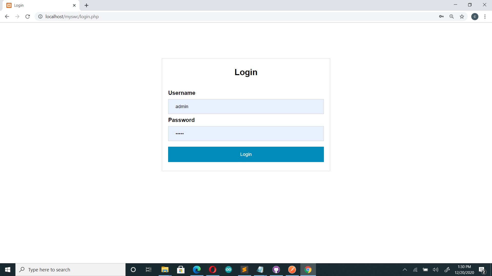
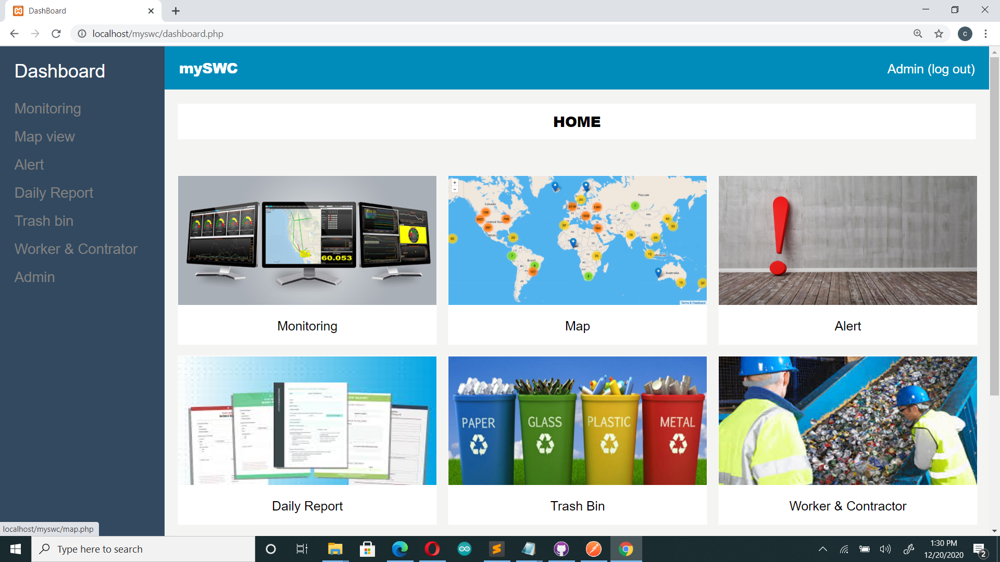
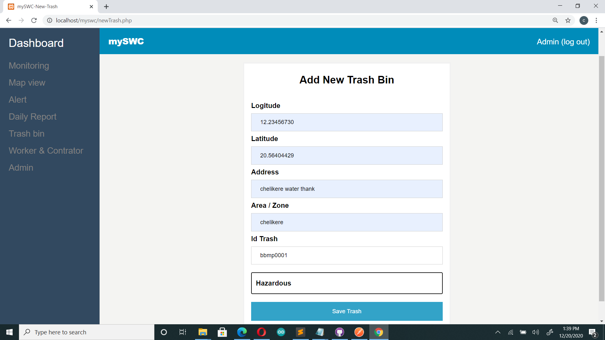
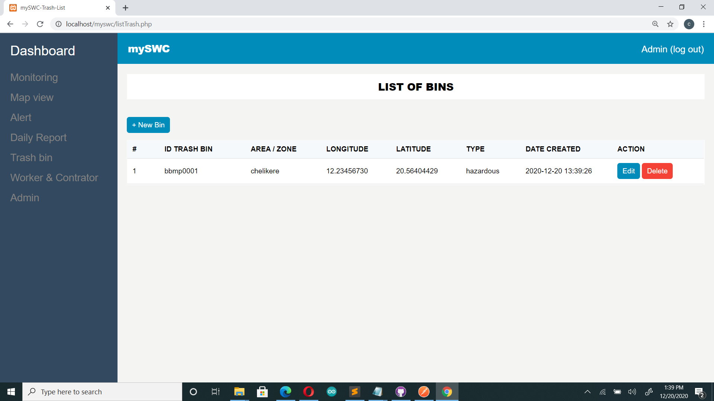
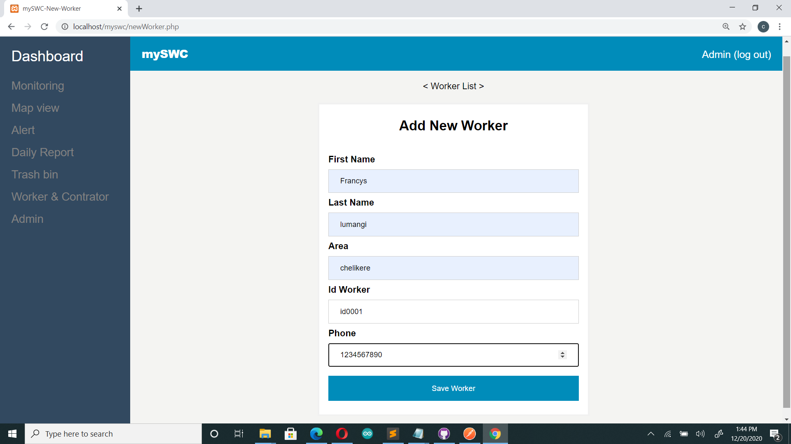
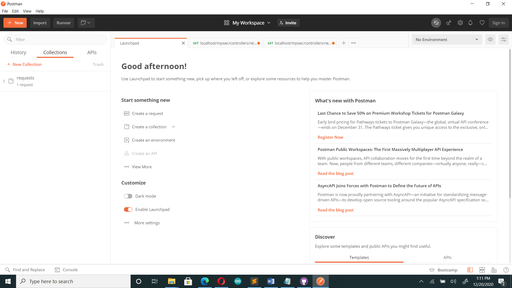
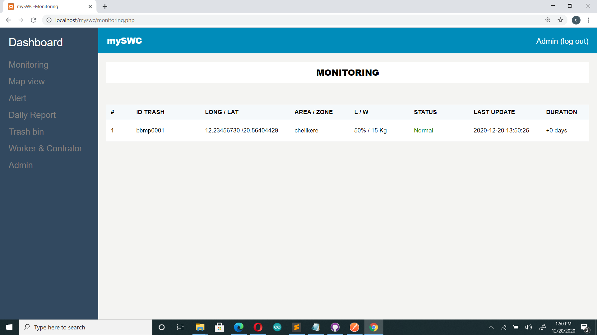
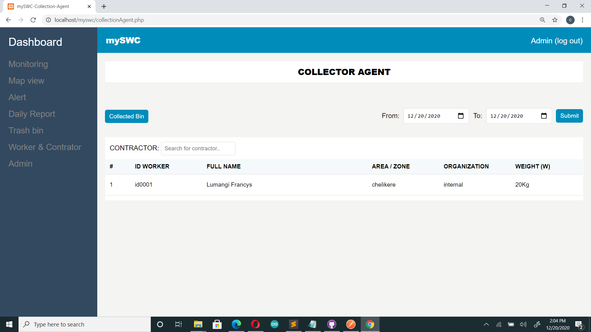

# My Solid Waste Collection (mySWC)  

mySWC app is a tool developed to help municipalities collect accurate data on the municipal solid waste collection operation. This application works with a smart bin that collects the data directly inside the trash bin thanks to the sensors, and sends them to the mySWC appl. This application allows the management of trash bin in the system, including adding new, as well as updating and deleting existing trash bin in the system. In addition, it allows the management of municipal workers and contractors involved in the municipal solid waste collection program, including the creation of new workers and/or contractors, as well as the updating and deletion of existing worker/contractor in the system. Furthermore, it enables user management, activity reporting and real-time monitoring.
 
## To begin

In order to better use the application, make sure you have the required software and you follow the configuration steps provided below.

### Prerequisites

Please download one of the following applications depending on the operating system installed on your computer. The choice is yours, for my case I am using xampp because my computer is running Windows 10.

* Xampp 	(Windows OS)
* LAMP		(Linux OS)
* MAMP		(Mac OS)

For the text editor, you have several choices among:

* PHPSTORM
* VScode,
* SublimeText
* Atom text editor
* etc.

### Installation

Here are the steps to follow to install the application on your computer.

Start by cloning the project via the link below:

$ git clone https://github.com/conordata/myswc

Unzip the download folder then move the extracted folder to:

* C:\xampp\htdocs if you are using **Xampp**
* $ /var/www/html if you are on **Linux**

Then create a new database named **trashproject** in phpMyadmin 

After creating a new database successfully, go to import, then import the database dump file **trashproject.sql** available in the unzipped file

If there is no error, you should be ready to run the application on your local computer

## Start-up

After installing the prerequisite software and configuring the app, open any browser available on your computer and enter the address **localhost/myswc** in the address bar to start or click here http://127.0.0.1/myswc. 

For my case, I use Google Chrome as my browser

## Login details

* username: admin
* password: admin

## Home Page

Voila, we can easily access the application

## Trash bin management

Once the application is launched, the first thing to do is to add at least one trash bin in the system.
To do this, go to the **Trash bin -> new Trash bin**, then fill out all the required fields.

 

Note that each trash bin **must** have a unique identifier to which it is referenced in the system. We advise you to choose a uniform way of assigning identifiers in order to facilitate their referencing in the system.

For example: name_of_the_municipality followed by a number (bbmp0001)

- For testing, give **bbmp0001**

After successfully adding the Trash bin, go to the **List of Bins** to see all the bins registered in the system. In the list, you can delete or modify the trash bin already present in the system.

## Worker and Contractor management

After adding a new recycle bin to the system, the second thing to do is add a new worker to be assigned to the collect operation. To do this, go to Worker & Contractor -> New worker, fill in all the required fields.

Here too, each worker **must** have a unique identifier. At this stage, you can give an ID of your choice.

- For testing, give **id0001** 

## Monitoring

At this stage, everything is in place to monitor and generate the report. To test if everything works well, download the Postman software which is an API (Application Programming Interface) client that allows you to send an HTTP request - Download here https://www.postman.com/downloads/

* Go to create new request and enter **localhost/myswc/controllers/newHistoric.php?idTrash=bbmp0001&level=50&weight=15** (monitoring request) in the URL request, then send it with a GET method.

* Go in monitoring page you should see a new record.

* Enter **localhost/myswc/controllers/newHistoric.php?idTrash=bbmp0001&level=81&weight=20** then send it

The level values should change, as well as the status (from normal to alert!)

* Go also in alert page you should see this record

* Enter **localhost/myswc/controllers/newScan.php?idTrash=bbmp0001&idWorker=id0001** (collection request) then send it 

The record should disappear from monitoring and alert page

## Report

After sending the monitoring and collection requests

* Go in **Daily Report -> Collected Bin**. You should that the bin has been collected with all the details

* Go in **Daily Report -> Collection Agent**. You should the details on the collector agent.

## Use the App with the Smart Trash bin

## Note

* Regarding the Worker unique ID, as we are using the RFID module, use the RFID card that comes directly with a unique identifier, and then refer to the link https://create.arduino.cc/projecthub/Aritro/security-access-using-rfid-reader-f7c746 in order to extract the identifier from the card and use it in the system.

* Regarding Contractors, when you create a new contractor, a username for the contractor Admin is generated automatically, as well as a default password that the Contractor admin can change later - Default password: **12345**.

## Made with

Here is the list of technogies used, no frameWork was used, everything is done with native:

* [HTML] (https://www.w3schools.com/html/) - Hyper Text Markup Language (Front-end)
* [CSS] (https://www.w3schools.com/Css/) - Cascading Style Sheet (front-end)
* [PHP] (https://www.w3schools.com/php/) - Hypertext Preprocessor Language (Back-end)
* [JAVASCRIPT] (https://www.w3schools.com/html/html_scripts.asp) - Javascript Language (Front-end)
* [Sublime Text] (https://www.sublimetext.com/) - Text editor

## Authors

* **ILUNGA WA LUNDA Ariel** _alias_ [@conordata](https://github.com/conordata)

## Open Source

